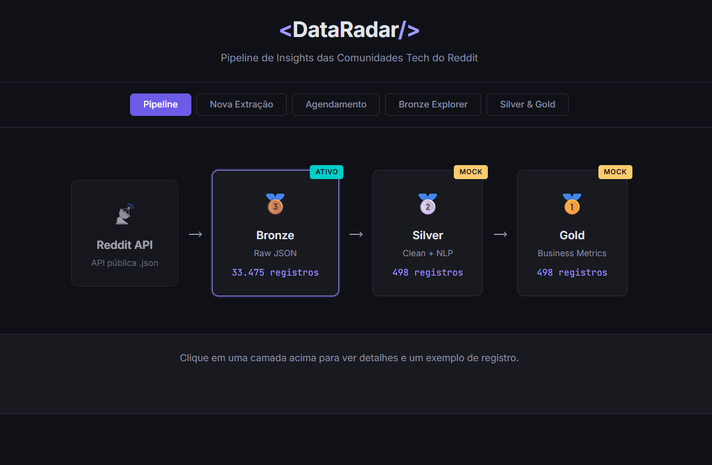
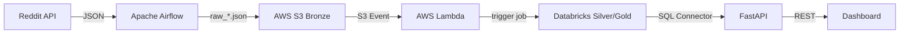

# DataRadar

> Pipeline de dados end-to-end que monitora 72+ comunidades tech do Reddit — da ingestao a visualizacao, seguindo a **Medallion Architecture** (Bronze -> Silver -> Gold).

[](https://github.com/wesleyolvr/DataRadar/actions/workflows/ci.yml)
[](https://python.org)
[](LICENSE)
[](https://github.com/astral-sh/ruff)



## O que faz

O DataRadar extrai posts e comentarios de subreddits de tecnologia em tempo real, processa os dados em camadas (Bronze -> Silver -> Gold) e expoe uma API + dashboard interativo para explorar tendencias, ferramentas mais mencionadas e metricas de engajamento.

**Numeros atuais:**
- 72 subreddits monitorados (de `r/dataengineering` a `r/vibecoding`)
- Extracao automatica a cada hora via Airflow
- Pipeline completo: Reddit -> Airflow -> S3 -> Lambda -> Databricks -> Dashboard

## Arquitetura



## Stack

| Componente | Tecnologia |
|------------|-----------|
| Orquestracao | Apache Airflow 2.10 (Docker Compose) |
| Ingestao | Python + requests (API publica Reddit) |
| Storage Bronze | AWS S3 (JSON particionado por subreddit/data) |
| Processamento | Databricks (PySpark + Delta Lake) |
| Serving | Databricks SQL Warehouse (Serverless) |
| API | FastAPI + uvicorn |
| Frontend | HTML/CSS/JS (estatico) |
| CI/CD | GitHub Actions -> lint + test + deploy Lambda |

## Decisoes Tecnicas

| Decisao | Escolha | Por que |
|---------|---------|---------|
| Ingestao | API publica sem OAuth | Simplicidade; rate limit controlado via Airflow Pool + backoff exponencial |
| Arquitetura | Medallion (Bronze/Silver/Gold) | Separacao de responsabilidades; reprocessamento sem perda de dados brutos |
| Orquestracao | Airflow (nao Dagster/Prefect) | Maturidade do ecossistema; DAGs parametrizaveis; dynamic task mapping |
| Trigger | Lambda event-driven (nao polling) | Custo zero quando inativo; reage em segundos ao novo arquivo no S3 |
| Concorrencia | Pool do Airflow (2 slots) | Evita cascata de rate limit 429; comments serializado (1 slot) |
| Serving | SQL Connector direto ao Databricks | Dados sempre atualizados; elimina ETL intermediario; warehouse serverless |

## Quick Start

### Pre-requisitos

- Python 3.11+
- Docker e Docker Compose (para Airflow)
- Conta AWS com S3 (opcional, para upload)

### Setup

```bash
# 1. Clone o repo
git clone https://github.com/wesleyolvr/DataRadar.git
cd DataRadar

# 2. Crie e configure o .env
cp .env.example .env
# Edite .env com suas credenciais AWS

# 3. Instale dependencias de desenvolvimento
pip install pytest ruff

# 4. Rode os testes
pytest tests/ -v

# 5. Suba o Airflow
cd airflow
docker compose up -d

# 6. Rode a API
cd ../app
pip install -r requirements.txt
uvicorn main:app --reload
```

## Estrutura do Projeto

```
DataRadar/
├── airflow/            # DAGs, scripts de extracao, Docker Compose
│   ├── dags/           # 3 DAGs (manual, parametrizada, agendada)
│   ├── scripts/        # Modulo de extracao do Reddit
│   └── docker-compose.yml
├── app/                # API FastAPI + frontend estatico
│   ├── routers/        # Endpoints (bronze, ingest, pipeline)
│   ├── services/       # Leitura Bronze + cliente Databricks
│   └── static/         # Dashboard HTML/CSS/JS
├── lambda/             # AWS Lambda (trigger Databricks via S3 event)
├── scripts/            # Utilitarios (trigger DAG, replay Lambda)
├── tests/              # 55+ testes automatizados (pytest)
└── docs/               # Arquitetura, setup, planos
```

## Agendamento


## Documentacao

- [Arquitetura detalhada](docs/architecture.md)
- [Setup completo](docs/setup.md)
- [Roadmap e melhorias](MELHORIAS.md)

## Licenca

[MIT](LICENSE)
