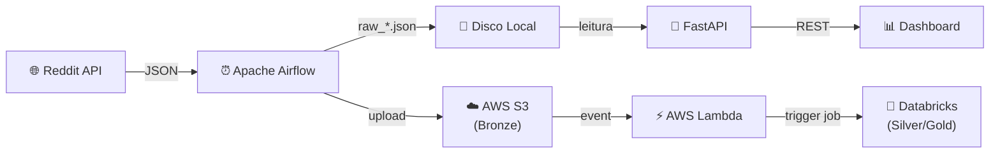

# DataRadar

Pipeline de insights sobre comunidades tech do Reddit — da ingestão à visualização, seguindo a **Medallion Architecture** (Bronze → Silver → Gold).

[](https://github.com/SEU_USUARIO/dataradar/actions/workflows/ci.yml)

## O que faz

O DataRadar extrai posts e comentários de subreddits de tecnologia, processa e armazena os dados em camadas, e expõe uma API + dashboard para explorar os resultados.

## Arquitetura



## Stack

| Componente | Tecnologia |
|------------|-----------|
| Orquestração | Apache Airflow 2.10 (Docker Compose) |
| Ingestão | Python + requests (API pública Reddit) |
| Storage Bronze | JSON local + AWS S3 |
| Processamento | Databricks (Spark + Delta Lake) |
| API | FastAPI + uvicorn |
| Frontend | HTML/CSS/JS (estático) |
| CI/CD | GitHub Actions (ruff + pytest) |

## Quick Start

### Pré-requisitos

- Python 3.11+
- Docker e Docker Compose (para Airflow)
- Conta AWS com S3 (opcional, para upload)

### Setup

```bash
# 1. Clone o repo
git clone https://github.com/SEU_USUARIO/dataradar.git
cd dataradar

# 2. Crie e configure o .env
cp .env.example .env
# Edite .env com suas credenciais AWS

# 3. Instale dependências de desenvolvimento
pip install pytest ruff

# 4. Rode os testes
pytest tests/ -v

# 5. Suba o Airflow
cd airflow
docker compose up -d

# 6. Rode a API
cd ../app
pip install -r requirements.txt
uvicorn main:app --reload
```

## Estrutura do Projeto

```
dataradar/
├── airflow/            # DAGs, scripts de extração, Docker Compose
│   ├── dags/           # DAGs do Airflow
│   ├── scripts/        # Módulo de extração do Reddit
│   └── docker-compose.yml
├── app/                # API FastAPI + frontend estático
│   ├── routers/        # Endpoints (bronze, ingest, pipeline)
│   ├── services/       # Lógica de leitura e transformação
│   └── static/         # HTML/CSS/JS do dashboard
├── lambda/             # AWS Lambda (trigger Databricks)
├── scripts/            # Utilitários (trigger DAG, teste S3)
├── tests/              # Testes automatizados (pytest)
└── docs/               # Documentação adicional
```

## Documentação

- [Arquitetura detalhada](docs/architecture.md)
- [Setup completo](docs/setup.md)
- [Melhorias pendentes](MELHORIAS.md)

## Licença

[MIT](LICENSE)
