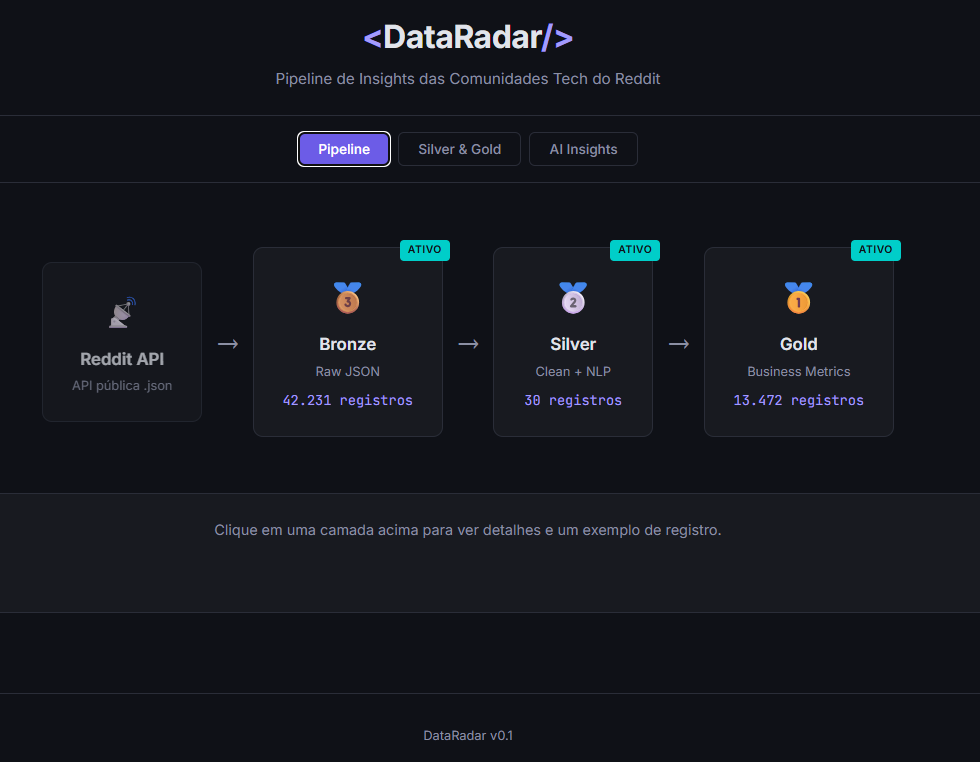
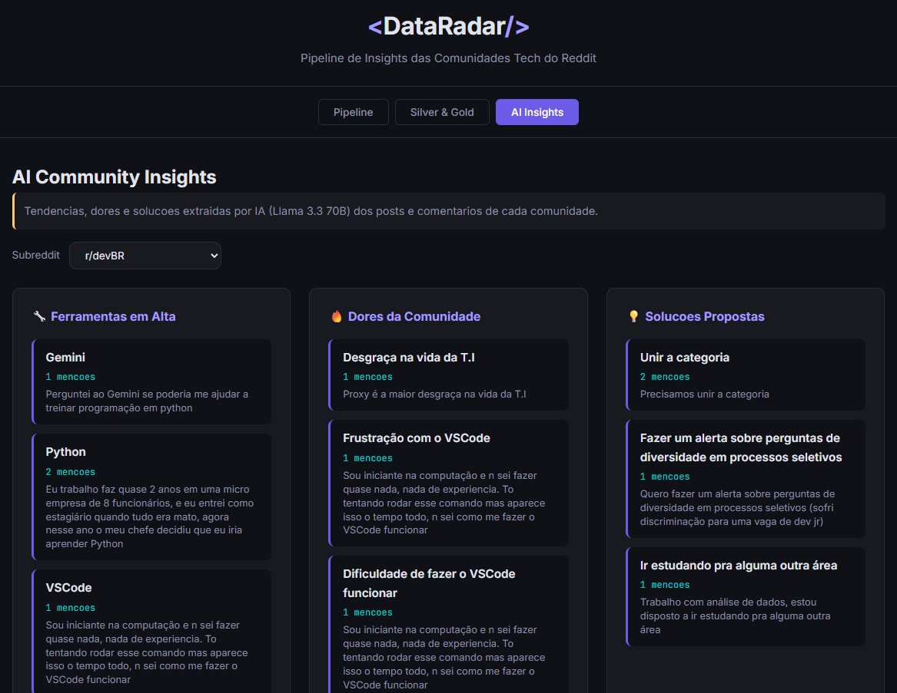
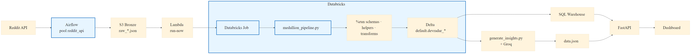
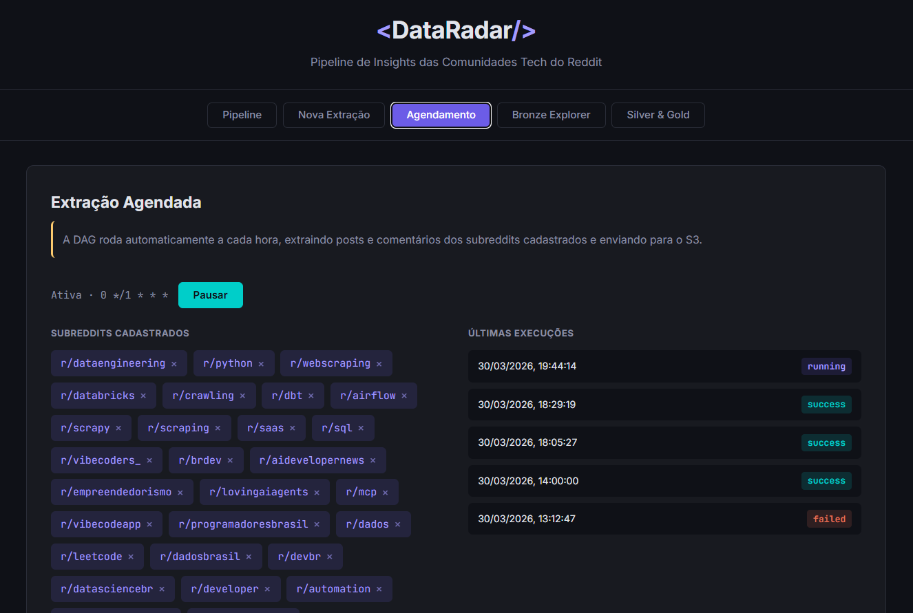

# DataRadar

> Radar de tendencias tech alimentado por IA — monitora 72+ comunidades do Reddit, processa dados em camadas (Medallion Architecture) e usa LLM para extrair insights sobre ferramentas, dores e solucoes de cada comunidade.

[](https://github.com/wesleyolvr/DataRadar/actions/workflows/ci.yml)
[](https://python.org)
[](LICENSE)
[](https://github.com/astral-sh/ruff)



## O que faz

O DataRadar extrai posts e comentarios de 72+ subreddits de tecnologia, processa em camadas (Bronze -> Silver -> Gold) e usa **LLM (Llama via Groq)** para analisar o conteudo e extrair insights estruturados: ferramentas em alta, dores da comunidade e solucoes propostas.

**Numeros atuais:**
- 72 subreddits monitorados (de `r/dataengineering` a `r/vibecoding`)
- Extracao automatica a cada hora via Airflow
- 71 comunidades com AI Insights gerados
- Pipeline completo: Reddit -> Airflow -> S3 -> Lambda -> Databricks -> LLM -> Dashboard

### AI Insights

Aba do dashboard com insights por subreddit (ferramentas em alta, dores da comunidade, solucoes propostas).



## Arquitetura

Visão geral do fluxo de dados e da stack. O diagrama abaixo é o **PNG** `docs/assets/arquitetura_dataradar.png`, gerado a partir da fonte Mermaid `docs/assets/arquitetura_dataradar.mmd` (Databricks Job → `medallion_pipeline.py` → `%run` → Delta). Para alterar o desenho, edite o `.mmd` e regenere o PNG (comandos em [`docs/assets/DIAGRAMAS.md`](docs/assets/DIAGRAMAS.md)). Um desenho em estilo sketch opcional pode ficar em `arquitetura_dataradar.excalidraw`.



Diagrama equivalente em texto (útil para forks e diffs):

```mermaid
%%{init: {'themeVariables': {'fontSize': '22px'}, 'flowchart': {'nodeSpacing': 72, 'rankSpacing': 88, 'padding': 20}}}%%
flowchart LR
    Reddit["Reddit API"] --> Airflow["Apache Airflow\nPool reddit_api"]
    Airflow --> S3["AWS S3 Bronze\nraw_*.json"]
    S3 --> Lambda["AWS Lambda\nrun-now job"]
    Lambda --> DbJob["Databricks Job"]
    subgraph Databricks["Databricks"]
        DbJob --> Entry["medallion_pipeline.py"]
        Entry --> Run["%run · Delta MERGE"]
        Run --> Delta["Silver / Gold\nDelta"]
    end
    Delta -->|SQL Warehouse| FastAPI["FastAPI"]
    Delta -->|generate_insights + Groq| Groq["Groq API\nLlama 3.1"]
    Groq --> DataJSON["data.json\ninsights"]
    DataJSON --> FastAPI
    FastAPI --> UI["Dashboard"]
```



## Stack

| Componente | Tecnologia |
|------------|-----------|
| Orquestracao | Apache Airflow 2.10 (Docker Compose) |
| Ingestao | Python + requests (API publica Reddit) |
| Storage Bronze | AWS S3 (JSON particionado por subreddit/data) |
| Processamento | Databricks (PySpark + Delta Lake) |
| Serving | Databricks SQL Warehouse (Serverless) |
| API | FastAPI + uvicorn |
| AI Insights | Groq API (Llama 3.1 8B) + OpenAI SDK |
| Frontend | HTML/CSS/JS (estatico) |
| CI/CD | GitHub Actions -> lint + test + deploy Lambda |

## Decisoes Tecnicas

| Decisao | Escolha | Por que |
|---------|---------|---------|
| Ingestao | API publica sem OAuth | Simplicidade; rate limit controlado via Airflow Pool + backoff exponencial |
| Arquitetura | Medallion (Bronze/Silver/Gold) | Separacao de responsabilidades; reprocessamento sem perda de dados brutos |
| Orquestracao | Airflow (nao Dagster/Prefect) | Maturidade do ecossistema; DAGs parametrizaveis; dynamic task mapping |
| Trigger | Lambda event-driven (nao polling) | Custo zero quando inativo; reage em segundos ao novo arquivo no S3 |
| Concorrencia | Pool do Airflow (2 slots) | Evita cascata de rate limit 429; comments serializado (1 slot) |
| Serving | SQL Connector direto ao Databricks | Dados sempre atualizados; elimina ETL intermediario; warehouse serverless |
| AI Insights | Groq (Llama 3.1 8B) via OpenAI SDK | Free tier generoso (500K TPD); resposta rapida; JSON estruturado |

## Quick Start

### Pre-requisitos

- Python 3.11+
- Docker e Docker Compose (para Airflow)
- Conta AWS com S3 (opcional, para upload)

### Setup

```bash
# 1. Clone o repo
git clone https://github.com/wesleyolvr/DataRadar.git
cd DataRadar

# 2. Crie e configure o .env
cp .env.example .env
# Edite .env com suas credenciais AWS

# 3. Instale dependencias de desenvolvimento
pip install pytest ruff

# 4. Rode os testes
pytest tests/ -v

# 5. Suba o Airflow
cd airflow
docker compose up -d

# 6. Rode a API
cd ../app
pip install -r requirements.txt
uvicorn main:app --reload
```

## Estrutura do Projeto

```
DataRadar/
├── airflow/            # DAGs, scripts de extracao, Docker Compose
│   ├── dags/           # 3 DAGs (manual, parametrizada, agendada)
│   ├── scripts/        # Modulo de extracao do Reddit
│   └── docker-compose.yml
├── app/                # API FastAPI + frontend estatico
│   ├── routers/        # Endpoints (bronze, ingest, pipeline)
│   ├── services/       # Leitura Bronze + cliente Databricks
│   └── static/         # Dashboard HTML/CSS/JS
├── databricks/         # Notebooks PySpark (Job) + SQL
│   ├── notebooks/      # medallion_pipeline.py (entrada) + modulos %run
│   └── sql/            # Scripts SQL (ex.: gold_ai_insights)
├── lambda/             # AWS Lambda (run-now do Job ao subir raw_*.json no S3)
├── scripts/            # Utilitarios (generate_insights, replay Lambda)
├── tests/              # 55+ testes automatizados (pytest)
└── docs/               # Arquitetura, setup, planos
```

Para configurar o Job no Databricks (path no Repos, tabelas, secrets), veja [databricks/README.md](databricks/README.md).

## Agendamento

Extracao horaria dos subreddits cadastrados via DAG do Airflow.



## Documentacao

- [Arquitetura detalhada](docs/architecture.md)
- [Setup completo](docs/setup.md)
- [Databricks — notebooks, SQL e Job](databricks/README.md)
- [Diagramas — regenerar PNG de arquitetura](docs/assets/DIAGRAMAS.md)
- [Roadmap e melhorias](MELHORIAS.md)

## Licenca

[MIT](LICENSE)
