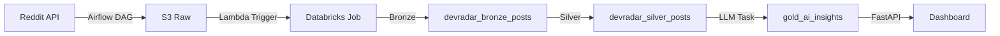

# 🚀 DataRadar - Pipeline End-to-End Deploy Guide

## ✅ Status Atual (2026-04-13)

| Componente | Status | Deploy Method | URL/Location |
|-----------|--------|---------------|--------------|
| **Terraform (AWS)** | ✅ Deployed | Manual local | S3: devradar-raw, Lambda, SSM |
| **Databricks** | ✅ Configured | Manual | Tables: bronze/silver/gold |
| **Airflow (Astronomer)** | 🔄 Ready to deploy | `astro deploy -f` | Workspace: devradar-prod |
| **API (Render)** | ✅ Deployed | Auto via Git | render.com/devradar-api |
| **Frontend (Vercel)** | ✅ Deployed | Auto via Git | vercel.app/devradar |

---

## 📋 Checklist de Deploy Completo

### 1. ✅ Infraestrutura AWS (Terraform)

```powershell
cd terraform
terraform init
terraform apply
```

**Criados:**
- S3 bucket `devradar-raw` (raw data Bronze layer)
- Lambda function (trigger Databricks job on S3 upload)
- IAM role com políticas (Lambda, S3, SSM)
- SSM parameters (Databricks host/token/job_id, Groq API key)

### 2. ✅ Databricks Workspace

**Tabelas criadas:**

```sql
-- Via databricks/sql/create_gold_ai_insights_v2.sql
CREATE TABLE gold_ai_insights (...)
```

**Git Repos sync:**
- Settings → Git Integration → Add Repo
- URL: https://github.com/wesley/devradar (ajuste username)
- Branch: main
- Path: `/databricks/notebooks/`

### 3. 🔄 Airflow (Astronomer) - **PRÓXIMO PASSO**

#### 3.1. Deploy do código:

```powershell
cd airflow
astro deploy -f
```

#### 3.2. Configurar Environment Variables:

```powershell
# Databricks
astro deployment variable create --deployment-id cmnxykyos7osr01n8jw4n8ix6 \
  --key DATABRICKS_HOST --value "dbc-0aa95f00-..." --secret

astro deployment variable create --deployment-id cmnxykyos7osr01n8jw4n8ix6 \
  --key DATABRICKS_TOKEN --value "dapi..." --secret

astro deployment variable create --deployment-id cmnxykyos7osr01n8jw4n8ix6 \
  --key DATABRICKS_WAREHOUSE_ID --value "..." --secret

# Groq API
astro deployment variable create --deployment-id cmnxykyos7osr01n8jw4n8ix6 \
  --key GROQ_API_KEY --value "gsk_..." --secret

# AWS (para boto3 S3 upload)
astro deployment variable create --deployment-id cmnxykyos7osr01n8jw4n8ix6 \
  --key AWS_ACCESS_KEY_ID --value "..." --secret

astro deployment variable create --deployment-id cmnxykyos7osr01n8jw4n8ix6 \
  --key AWS_SECRET_ACCESS_KEY --value "..." --secret

astro deployment variable create --deployment-id cmnxykyos7osr01n8jw4n8ix6 \
  --key AWS_DEFAULT_REGION --value "us-east-1"

# S3 bucket name
astro deployment variable create --deployment-id cmnxykyos7osr01n8jw4n8ix6 \
  --key DEVRADAR_S3_BUCKET --value "devradar-raw"
```

#### 3.3. Configurar Airflow Variable (lista de subreddits):

**Via UI:**
1. Abrir Airflow UI no Astronomer
2. Admin → Variables → Create
3. Key: `devradar_subreddits`
4. Value: `["dataengineering", "python", "rust"]`

#### 3.4. Trigger Manual + Validação:

1. DAGs → `devradar_reddit_scheduled` → Trigger DAG
2. Aguardar ~15-20 min
3. Verificar logs de cada task
4. Validar dados:
   - S3: `s3://devradar-raw/reddit/dataengineering/date=2026-04-13/`
   - Databricks: `SELECT * FROM gold_ai_insights ORDER BY generated_at DESC`

### 4. ✅ API Backend (Render)

**Deploy automático via Git** (já configurado):
- Push para `main` → auto-deploy
- Env vars configuradas no Render dashboard
- URL: https://devradar-api-xxx.onrender.com

**Próxima atualização:** Refatorar para consumir `gold_ai_insights` (em vez de `data.json`)

### 5. ✅ Frontend (Vercel)

**Deploy automático via Git** (já configurado):
- Push para `main` → auto-deploy
- Build command: `npm run build` (ou similar)
- URL: https://devradar-xxx.vercel.app

**Próxima atualização:** Atualizar JS para chamar novo endpoint API

---

## 🔧 Ordem de Execução do Pipeline



**Frequência:** A cada 6 horas (Airflow schedule)

1. **Airflow DAG** (`devradar_reddit_scheduled`):
   - Extrai posts do Reddit (extract)
   - Valida schema (validate)
   - Salva local + cache (save_local)
   - Extrai comentários (extract_comments)
   - Upload S3 (upload_to_s3)
   - **Gera insights LLM (generate_insights)** ← NOVO

2. **Lambda** (trigger automático S3):
   - Monitora uploads em `s3://devradar-raw/reddit/*/raw_*.json`
   - Dispara Databricks job (bronze → silver processing)

3. **Databricks Notebooks**:
   - Bronze: Ingere JSON raw
   - Silver: Limpeza + padronização
   - (Gold LLM agora é task do Airflow)

4. **API + Frontend**:
   - API lê `gold_ai_insights` table
   - Frontend consome API e renderiza dashboard

---

## 🎯 Próximas Implementações

### A. Refatorar API para consumir `gold_ai_insights`

**Arquivo:** `app/main.py`

```python
# Substituir endpoint /api/data (que lê data.json)
# Por novo endpoint /api/insights (que query Databricks)

from databricks import sql

@app.get("/api/insights")
def get_insights():
    with sql.connect(...) as conn:
        cursor = conn.cursor()
        cursor.execute("""
            SELECT subreddit, insight_type, item_name, mentions, context
            FROM gold_ai_insights
            WHERE execution_date = (SELECT MAX(execution_date) FROM gold_ai_insights)
            ORDER BY subreddit, insight_type, mentions DESC
        """)
        ...
```

### B. Atualizar Frontend

**Arquivo:** `app/static/js/main.js`

```javascript
// Substituir fetch('/api/data')
// Por fetch('/api/insights')
// Adaptar parsing do JSON (schema mudou)
```

### C. Monitoramento (Grafana Cloud)

**Pendente:**
- Integrar métricas CloudWatch → Grafana
- Dashboards: Airflow DAG runs, Lambda invocations, Databricks job status
- Alertas: Pipeline failures, LLM API errors

### D. Documentação para Recrutadores

**Criar:** `docs/PORTFOLIO.md`
- Arquitetura end-to-end diagram
- Tech stack justification
- Cost breakdown ($0/month strategy)
- Trade-offs e decisões técnicas
- Demo screenshots

---

## 📊 Custos Estimados (Free Tier)

| Serviço | Free Tier | Uso Estimado | Custo/mês |
|---------|-----------|--------------|-----------|
| **AWS S3** | 5 GB | ~500 MB | $0 |
| **AWS Lambda** | 1M req/mês | ~4k req | $0 |
| **Databricks CE** | Community | 1 cluster | $0 |
| **Astronomer** | Trial 14d → Free | 1 DAG 4x/dia | $0 → $0 |
| **Groq API** | 14.4k req/dia | ~12 req/dia | $0 |
| **Render** | 750h/mês | API deploy | $0 |
| **Vercel** | Hobby plan | Frontend | $0 |
| **Grafana Cloud** | 14d trial → Free | Dashboards | $0 |
| **TOTAL** | | | **$0/mês** |

---

## 🚨 Troubleshooting

### Airflow DAG não aparece na UI
→ Verificar logs: Admin → Browse → DAG Errors  
→ Syntax error em `dag_reddit_scheduled.py`?

### Task `generate_insights` falha
→ Verificar env vars: GROQ_API_KEY, DATABRICKS_*  
→ Logs: `Error: GROQ_API_KEY não configurada`

### Lambda não triggera Databricks
→ Verificar S3 event notifications: `terraform/s3.tf`  
→ Lambda logs CloudWatch: `/aws/lambda/devradar-prod-*`

### API retorna dados desatualizados
→ Ainda lendo `data.json` em vez de `gold_ai_insights`  
→ Implementar novo endpoint (passo A acima)

---

## ✅ Status Final

**O que funciona agora:**
- ✅ Pipeline Airflow → S3 → Lambda → Databricks (bronze/silver)
- ✅ LLM insights task integrada ao DAG
- ✅ Deploy automático API + Frontend
- ✅ Infraestrutura 100% provisionada (Terraform)

**Falta:**
1. Deploy Airflow + configurar env vars (15 min)
2. Refatorar API para ler `gold_ai_insights` (30 min)
3. Atualizar frontend JS (20 min)
4. Setup Grafana dashboards (45 min)
5. Documentação portfolio (1-2h)

**Tempo total restante:** ~4 horas 🚀
