# Post LinkedIn — DataRadar

> Rascunho para publicacao. Anexar imagem: screenshot da aba **AI Insights** ou export PNG do diagrama de arquitetura (abaixo). O LinkedIn **nao renderiza** Mermaid; use o bloco so como referencia ou gere PNG/SVG no Excalidraw.

---

Construi um radar de tendencias tech alimentado por IA que monitora 72 comunidades do Reddit e extrai insights automaticamente.

O DataRadar coleta milhares de posts e comentarios, processa em camadas (Bronze -> Silver -> Gold) e usa LLM (Llama via Groq) para identificar:
-> Ferramentas em alta em cada comunidade
-> Dores e frustracoes reais dos devs
-> Solucoes que a comunidade esta propondo

Exemplo real: o radar detectou que r/dataengineering esta migrando de Airflow para Dagster, que r/vibecoding reclama de falta de controle em codigo gerado por IA, e que r/devBR discute muito sobre CLT vs PJ.

A stack completa:
-> Apache Airflow orquestrando ingestao horaria (72 subreddits)
-> AWS S3 como data lake + Lambda event-driven (custo zero quando inativo)
-> Databricks processando com PySpark + Delta Lake
-> Groq API (Llama 3.1 8B) analisando conteudo e extraindo insights estruturados
-> FastAPI + dashboard interativo com dados reais

O maior desafio tecnico: conciliar rate limiting da API do Reddit com 72 subreddits em paralelo. Resolvi com Airflow Pools (concorrencia controlada) + retry exponencial respeitando Retry-After. A diferenca entre "funciona no teste" e "funciona em producao" e enorme.

Tudo open source, com CI/CD, 55+ testes e deploy automatizado.

GitHub: https://github.com/wesleyolvr/DataRadar

#DataEngineering #Python #AI #LLM #ApacheAirflow #Databricks #AWS #OpenSource #DataPipeline #MachineLearning

---

## Diagrama de arquitetura (referencia Mermaid → Excalidraw)

Use o fluxo abaixo como **roteiro** no [Excalidraw](https://excalidraw.com/): copie os nos e setas na mesma ordem; transforme as caixas `PoolsNote`, `EventNote` e `Stack` em **notas** ou **texto solto** ao lado (estilo sketch).

**Checklist visual (alinha ao repo real):**
- Ingestao: Reddit → Airflow (`reddit_api` pool) → S3 Bronze `raw_*.json`.
- Event-driven: S3 → Lambda (`run-now` job) → Databricks Job → `medallion_pipeline.py` (`%run` + MERGE Delta Silver/Gold).
- Serving: Databricks **SQL Warehouse** → FastAPI (Silver/Gold ao vivo).
- Insights IA: leitura **Silver** (SQL) → script batch + **Groq** → `data.json` → FastAPI → mesmo dashboard (e Vercel estatico).
- Destaque azul: **Airflow** e **Databricks**.
- Notas: Pools/429 Reddit; pipeline S3/Lambda/job; faixa **TECH STACK**.

```mermaid
flowchart LR
    %% Configuração de Estilo
    classDef default fill:#ffffff,stroke:#000000,stroke-width:1px,color:#000000;
    classDef highlight fill:#e6f7ff,stroke:#0066cc,stroke-width:2px,color:#000000;
    classDef note fill:#fffbd6,stroke:#f5d000,stroke-width:1px,color:#000000;

    subgraph Title [DataRadar — visao geral]
        direction LR

        %% Ingestão Medallion
        Reddit["Reddit API\nJSON publico"] --> Airflow["Apache Airflow\nDAGs + Pool reddit_api"]
        Airflow --> S3["AWS S3\nBronze raw_*.json"]
        S3 --> Lambda["AWS Lambda\nS3 event → run-now"]
        Lambda --> DbJob["Databricks Job"]
        DbJob --> Notebook["medallion_pipeline.py\n%run → Delta MERGE"]
        Notebook --> DatabricksOut["Silver / Gold\nDelta Lake"]

        %% Duas saidas do Databricks (como no codigo)
        DatabricksOut -->|SQL Warehouse| FastAPI["FastAPI\nDatabricks SQL + static"]
        DatabricksOut -->|generate_insights.py| Groq["Groq API\nLlama 3.1 insights"]
        Groq --> DataJSON["data.json\ninsights por subreddit"]
        DataJSON --> FastAPI
        FastAPI --> Dashboard["Dashboard\nHTML/CSS/JS\nVercel estatico opcional"]
    end

    class Airflow,DbJob,Notebook highlight;

    PoolsNote>"SOLUCAO RATE LIMIT:\nPool reddit_api + backoff\n+ Retry-After API Reddit"]
    Airflow -.-> PoolsNote

    EventNote>"1. Novo raw_*.json no S3\n2. Lambda run-now no Job\n3. medallion_pipeline.py + %run\n4. MERGE Delta Silver/Gold"]
    S3 -.-> EventNote
    Lambda -.-> EventNote

    Stack>"TECH STACK:\nAirflow | AWS S3/Lambda | Databricks Delta\nSQL Warehouse | Groq | FastAPI | GitHub Actions | Vercel"]

    class PoolsNote,EventNote,Stack note;
```

**Dica:** No Excalidraw, exporte PNG ~1600×900 para o carrossel do LinkedIn; mantenha o arquivo `.excalidraw` em `docs/assets/` junto do repo se quiser versionar o desenho.
