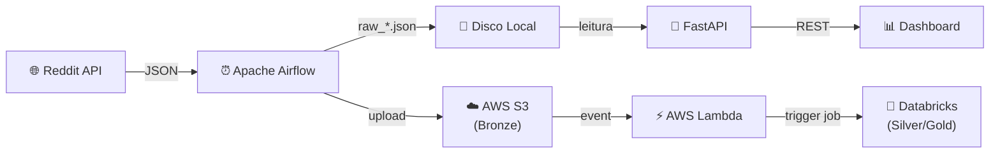

# DevRadar — Plano de Estabilização

> **For agentic workers:** REQUIRED SUB-SKILL: Use superpowers:subagent-driven-development (recommended) or superpowers:executing-plans to implement this plan task-by-task. Steps use checkbox (`- [ ]`) syntax for tracking.

**Goal:** Tornar o DevRadar publicável no GitHub — profissional, seguro e com qualidade de produção.

**Architecture:** Inicializar Git no `devradar/`, reorganizar estrutura de arquivos, adicionar testes pytest para funções puras e lógica de leitura Bronze, proteger credenciais via `.env.example` + `.gitignore` robusto, e configurar CI com GitHub Actions (ruff + pytest).

**Tech Stack:** Python 3.11, pytest, ruff, GitHub Actions

---

## File Structure

### Arquivos a criar

| Arquivo | Responsabilidade |
|---------|-----------------|
| `pyproject.toml` | Configuração do projeto, dependências dev (pytest, ruff), configuração ruff/pytest |
| `.env.example` | Template de variáveis de ambiente para a raiz |
| `LICENSE` | MIT License |
| `README.md` | Visão geral, diagrama Mermaid, quick start |
| `docs/architecture.md` | Detalhes de arquitetura dos componentes |
| `docs/setup.md` | Instruções detalhadas de setup de cada componente |
| `tests/__init__.py` | Marca diretório como package |
| `tests/conftest.py` | Fixtures compartilhadas (sample data, tmp dirs) |
| `tests/test_extract_reddit.py` | Testes de `_parse_post`, `_extract_parent_id`, `_flatten_comment_tree` |
| `tests/test_mock_layers.py` | Testes de `_extract_tools`, `transform_to_silver`, `aggregate_to_gold` |
| `tests/test_lambda_handler.py` | Testes de `_should_process`, `_is_valid_path` |
| `tests/test_bronze_reader.py` | Testes de deduplicação, paginação, edge cases |
| `.github/workflows/ci.yml` | Workflow lint + testes |
| `scripts/trigger_dag.py` | Movido de `trigger_dag.py` |
| `scripts/test_s3_upload.py` | Movido de `test_s3_upload.py`, sem `load_dotenv` hardcoded |

### Arquivos a modificar

| Arquivo | Mudança |
|---------|---------|
| `.gitignore` | Adicionar entradas faltantes |
| `MELHORIAS.md` | Já atualizado com decisões do grill-me |

### Arquivos a remover (da raiz)

| Arquivo | Motivo |
|---------|--------|
| `trigger_dag.py` | Movido para `scripts/` |
| `test_s3_upload.py` | Movido para `scripts/` |

---

## Task 1: Inicializar Git e .gitignore robusto

**Files:**
- Modify: `devradar/.gitignore`

- [ ] **Step 1: Atualizar o `.gitignore`**

```gitignore
# Python
__pycache__/
*.pyc
*.pyo
*.egg-info/
dist/
build/
*.egg

# Virtualenv
.venv/
venv/
ENV/

# Testes e linting
.pytest_cache/
.mypy_cache/
.ruff_cache/
.coverage
htmlcov/

# IDEs
.vscode/
.idea/
*.swp
*.swo

# Dados locais (não versionados)
airflow/logs/
airflow/plugins/
airflow/data/

# Secrets
.env
airflow/.env

# OS
.DS_Store
Thumbs.db
```

- [ ] **Step 2: Inicializar o repositório Git**

Run: `cd devradar && git init`
Expected: `Initialized empty Git repository in .../devradar/.git/`

- [ ] **Step 3: Verificar que .env NÃO aparece nos arquivos rastreados**

Run: `git status`
Expected: `.env` e `airflow/.env` NÃO aparecem na lista. Arquivos `.py`, `.yml`, `.md` aparecem como untracked.

- [ ] **Step 4: Commit inicial**

```bash
git add .gitignore
git commit -m "chore: init repo with comprehensive .gitignore"
```

---

## Task 2: Mover scripts manuais para `scripts/`

**Files:**
- Create: `scripts/trigger_dag.py`
- Create: `scripts/test_s3_upload.py`
- Delete: `trigger_dag.py` (raiz)
- Delete: `test_s3_upload.py` (raiz)

- [ ] **Step 1: Criar diretório `scripts/` e mover `trigger_dag.py`**

Run: `mkdir scripts && mv trigger_dag.py scripts/trigger_dag.py`

O `trigger_dag.py` não precisa de alteração — já usa `requests` direto sem `load_dotenv`.

- [ ] **Step 2: Mover e limpar `test_s3_upload.py`**

Copiar `test_s3_upload.py` para `scripts/test_s3_upload.py` e substituir o `load_dotenv` hardcoded:

```python
"""Teste rápido de upload para S3 — valida credenciais e acesso ao bucket."""

import os
from pathlib import Path

import boto3

BUCKET = os.getenv("DEVRADAR_S3_BUCKET", "devradar-raw")
REGION = os.getenv("AWS_DEFAULT_REGION", "us-east-1")

s3 = boto3.client(
    "s3",
    aws_access_key_id=os.getenv("AWS_ACCESS_KEY_ID"),
    aws_secret_access_key=os.getenv("AWS_SECRET_ACCESS_KEY"),
    region_name=REGION,
)

print(f"Bucket : {BUCKET}")
print(f"Region : {REGION}")
print(f"Key ID : {os.getenv('AWS_ACCESS_KEY_ID', '???')[:8]}...")

# 1) Testar listagem do bucket
print("\n[1] Listando objetos no bucket...")
try:
    resp = s3.list_objects_v2(Bucket=BUCKET, Prefix="reddit/", MaxKeys=5)
    contents = resp.get("Contents", [])
    if contents:
        for obj in contents:
            print(f"  {obj['Key']}  ({obj['Size'] / 1024:.1f} KB)")
    else:
        print("  (vazio)")
    print("  -> Listagem OK")
except Exception as e:
    print(f"  -> ERRO na listagem: {e}")

# 2) Testar upload de um arquivo pequeno
print("\n[2] Testando upload de arquivo de teste...")
test_key = "reddit/_test/ping.json"
test_body = b'{"test": true, "msg": "DevRadar S3 test"}'
try:
    s3.put_object(Bucket=BUCKET, Key=test_key, Body=test_body, ContentType="application/json")
    print(f"  -> Upload OK: s3://{BUCKET}/{test_key}")
except Exception as e:
    print(f"  -> ERRO no upload: {e}")
    raise

# 3) Testar upload de um arquivo real
print("\n[3] Testando upload de um arquivo real...")
data_dir = Path(__file__).parent.parent / "airflow" / "data" / "reddit"
real_files = sorted(data_dir.glob("*/date=*/raw_*.json"))

if real_files:
    local_path = real_files[0]
    relative = local_path.relative_to(data_dir)
    s3_key = f"reddit/{relative.as_posix()}"

    body = local_path.read_bytes()
    print(f"  Arquivo: {local_path.name} ({len(body) / 1024:.1f} KB)")
    print(f"  S3 Key : {s3_key}")

    try:
        s3.put_object(Bucket=BUCKET, Key=s3_key, Body=body, ContentType="application/json")
        print(f"  -> Upload OK: s3://{BUCKET}/{s3_key}")
    except Exception as e:
        print(f"  -> ERRO no upload: {e}")
else:
    print("  Nenhum arquivo raw_*.json encontrado em airflow/data/reddit/")

# 4) Limpeza do arquivo de teste
print("\n[4] Limpando arquivo de teste...")
try:
    s3.delete_object(Bucket=BUCKET, Key=test_key)
    print(f"  -> Removido: {test_key}")
except Exception as e:
    print(f"  -> Erro ao limpar (não crítico): {e}")

print("\nTeste concluído!")
```

- [ ] **Step 3: Remover originais da raiz**

Run: `rm trigger_dag.py test_s3_upload.py`

Verificar: `ls *.py` na raiz deve retornar vazio (sem arquivos Python na raiz).

- [ ] **Step 4: Commit**

```bash
git add scripts/ && git status
git commit -m "chore: move utility scripts to scripts/ and remove hardcoded load_dotenv"
```

---

## Task 3: pyproject.toml e configuração de ferramentas

**Files:**
- Create: `pyproject.toml`

- [ ] **Step 1: Criar `pyproject.toml`**

```toml
[project]
name = "devradar"
version = "0.1.0"
description = "Pipeline de insights sobre comunidades tech do Reddit — Medallion Architecture"
requires-python = ">=3.11"
license = {text = "MIT"}

[project.optional-dependencies]
dev = [
    "pytest>=8.0",
    "ruff>=0.4",
]

[tool.pytest.ini_options]
testpaths = ["tests"]
pythonpath = ["airflow/scripts", "app", "lambda"]

[tool.ruff]
target-version = "py311"
line-length = 120

[tool.ruff.lint]
select = ["E", "F", "W", "I", "UP", "B", "SIM"]
ignore = ["E501"]
```

- [ ] **Step 2: Verificar que o pytest consegue encontrar os módulos**

Run: `python -m pytest --collect-only 2>&1 || echo "Sem testes ainda — OK"`
Expected: Nenhum erro de import. Pode mostrar "no tests ran" (ainda não há testes).

- [ ] **Step 3: Commit**

```bash
git add pyproject.toml
git commit -m "chore: add pyproject.toml with pytest and ruff config"
```

---

## Task 4: .env.example e LICENSE

**Files:**
- Create: `.env.example`
- Create: `LICENSE`

- [ ] **Step 1: Criar `.env.example` na raiz**

```env
AWS_ACCESS_KEY_ID=your-access-key
AWS_SECRET_ACCESS_KEY=your-secret-key
AWS_DEFAULT_REGION=us-east-1
DEVRADAR_S3_BUCKET=devradar-raw
```

- [ ] **Step 2: Criar LICENSE (MIT)**

```text
MIT License

Copyright (c) 2026 Wesley

Permission is hereby granted, free of charge, to any person obtaining a copy
of this software and associated documentation files (the "Software"), to deal
in the Software without restriction, including without limitation the rights
to use, copy, modify, merge, publish, distribute, sublicense, and/or sell
copies of the Software, and to permit persons to whom the Software is
furnished to do so, subject to the following conditions:

The above copyright notice and this permission notice shall be included in all
copies or substantial portions of the Software.

THE SOFTWARE IS PROVIDED "AS IS", WITHOUT WARRANTY OF ANY KIND, EXPRESS OR
IMPLIED, INCLUDING BUT NOT LIMITED TO THE WARRANTIES OF MERCHANTABILITY,
FITNESS FOR A PARTICULAR PURPOSE AND NONINFRINGEMENT. IN NO EVENT SHALL THE
AUTHORS OR COPYRIGHT HOLDERS BE LIABLE FOR ANY CLAIM, DAMAGES OR OTHER
LIABILITY, WHETHER IN AN ACTION OF CONTRACT, TORT OR OTHERWISE, ARISING FROM,
OUT OF OR IN CONNECTION WITH THE SOFTWARE OR THE USE OR OTHER DEALINGS IN THE
SOFTWARE.
```

- [ ] **Step 3: Commit**

```bash
git add .env.example LICENSE
git commit -m "chore: add .env.example template and MIT license"
```

---

## Task 5: Testes — conftest.py e fixtures

**Files:**
- Create: `tests/__init__.py`
- Create: `tests/conftest.py`

- [ ] **Step 1: Criar `tests/__init__.py`**

Arquivo vazio.

- [ ] **Step 2: Criar `tests/conftest.py` com fixtures reutilizáveis**

```python
"""Fixtures compartilhadas para todos os testes."""

import json

import pytest


@pytest.fixture
def sample_raw_post():
    """Post cru no formato da API do Reddit."""
    return {
        "kind": "t3",
        "data": {
            "id": "abc123",
            "subreddit": "dataengineering",
            "title": "Migrating from Airflow to Dagster",
            "selftext": "We've been using Apache Airflow for 2 years and considering Dagster...",
            "author": "data_dev_42",
            "score": 142,
            "upvote_ratio": 0.93,
            "num_comments": 47,
            "created_utc": 1711800000,
            "permalink": "/r/dataengineering/comments/abc123/migrating_from_airflow_to_dagster/",
            "url": "https://www.reddit.com/r/dataengineering/comments/abc123/",
            "link_flair_text": "Discussion",
            "is_self": True,
        },
    }


@pytest.fixture
def sample_raw_comment():
    """Comentário cru no formato da API do Reddit."""
    return {
        "kind": "t1",
        "data": {
            "id": "comment_1",
            "parent_id": "t3_abc123",
            "author": "spark_fan",
            "body": "We switched to Dagster last year. The asset-based approach is great.",
            "score": 28,
            "created_utc": 1711803600,
            "replies": "",
        },
    }


@pytest.fixture
def sample_parsed_post():
    """Post já normalizado (output de _parse_post)."""
    return {
        "id": "abc123",
        "subreddit": "dataengineering",
        "title": "Migrating from Airflow to Dagster",
        "selftext": "We've been using Apache Airflow for 2 years and considering Dagster...",
        "author": "data_dev_42",
        "score": 142,
        "upvote_ratio": 0.93,
        "num_comments": 47,
        "created_utc": 1711800000,
        "created_date": "2024-03-30T12:00:00+00:00",
        "permalink": "/r/dataengineering/comments/abc123/migrating_from_airflow_to_dagster/",
        "url": "https://www.reddit.com/r/dataengineering/comments/abc123/",
        "flair": "Discussion",
        "is_self": True,
        "extracted_at": "2024-03-30T12:05:00+00:00",
    }


@pytest.fixture
def sample_bronze_snapshot(tmp_path):
    """Cria um snapshot Bronze válido em disco e retorna o diretório."""
    date_dir = tmp_path / "reddit" / "dataengineering" / "date=2026-03-30"
    date_dir.mkdir(parents=True)

    payload = {
        "subreddit": "dataengineering",
        "execution_date": "2026-03-30",
        "snapshot_at": "2026-03-30T12:00:00",
        "count": 3,
        "posts": [
            {"id": "p1", "subreddit": "dataengineering", "title": "Post about Spark", "score": 100, "num_comments": 20, "created_utc": 1711800000, "author": "dev1", "flair": "Discussion"},
            {"id": "p2", "subreddit": "dataengineering", "title": "Post about dbt", "score": 50, "num_comments": 10, "created_utc": 1711800100, "author": "dev2", "flair": "Tutorial"},
            {"id": "p3", "subreddit": "dataengineering", "title": "Post about Kafka", "score": 75, "num_comments": 15, "created_utc": 1711800200, "author": "dev3", "flair": None},
        ],
    }

    snapshot_path = date_dir / "raw_2026-03-30T12_00_00.json"
    snapshot_path.write_text(json.dumps(payload, ensure_ascii=False), encoding="utf-8")

    return tmp_path


@pytest.fixture
def sample_bronze_with_dupes(tmp_path):
    """Dois snapshots com posts duplicados (IDs repetidos, scores diferentes)."""
    date_dir = tmp_path / "reddit" / "dataengineering" / "date=2026-03-30"
    date_dir.mkdir(parents=True)

    snap1 = {
        "subreddit": "dataengineering",
        "snapshot_at": "2026-03-30T10:00:00",
        "count": 2,
        "posts": [
            {"id": "p1", "title": "Spark old", "score": 50, "num_comments": 10, "created_utc": 1711800000, "subreddit": "dataengineering", "author": "dev1"},
            {"id": "p2", "title": "dbt old", "score": 30, "num_comments": 5, "created_utc": 1711800100, "subreddit": "dataengineering", "author": "dev2"},
        ],
    }

    snap2 = {
        "subreddit": "dataengineering",
        "snapshot_at": "2026-03-30T14:00:00",
        "count": 2,
        "posts": [
            {"id": "p1", "title": "Spark updated", "score": 150, "num_comments": 40, "created_utc": 1711800000, "subreddit": "dataengineering", "author": "dev1"},
            {"id": "p3", "title": "Kafka new", "score": 75, "num_comments": 15, "created_utc": 1711800200, "subreddit": "dataengineering", "author": "dev3"},
        ],
    }

    (date_dir / "raw_2026-03-30T10_00_00.json").write_text(json.dumps(snap1), encoding="utf-8")
    (date_dir / "raw_2026-03-30T14_00_00.json").write_text(json.dumps(snap2), encoding="utf-8")

    return tmp_path
```

- [ ] **Step 3: Commit**

```bash
git add tests/
git commit -m "test: add conftest with shared fixtures for Bronze data"
```

---

## Task 6: Testes — extract_reddit.py

**Files:**
- Create: `tests/test_extract_reddit.py`
- Test: funções `_parse_post`, `_extract_parent_id`, `_flatten_comment_tree`

- [ ] **Step 1: Criar `tests/test_extract_reddit.py`**

```python
"""Testes das funções puras de extração do Reddit."""

from extract_reddit import _extract_parent_id, _flatten_comment_tree, _parse_post


class TestParsePost:
    def test_parses_all_fields(self, sample_raw_post):
        result = _parse_post(sample_raw_post)

        assert result["id"] == "abc123"
        assert result["subreddit"] == "dataengineering"
        assert result["title"] == "Migrating from Airflow to Dagster"
        assert result["author"] == "data_dev_42"
        assert result["score"] == 142
        assert result["upvote_ratio"] == 0.93
        assert result["num_comments"] == 47
        assert result["flair"] == "Discussion"
        assert result["is_self"] is True
        assert result["created_utc"] == 1711800000
        assert result["created_date"] is not None
        assert result["extracted_at"] is not None

    def test_handles_missing_optional_fields(self):
        raw = {"data": {"id": "minimal"}}
        result = _parse_post(raw)

        assert result["id"] == "minimal"
        assert result["selftext"] == ""
        assert result["score"] == 0
        assert result["num_comments"] == 0
        assert result["flair"] is None

    def test_handles_empty_data(self):
        raw = {}
        result = _parse_post(raw)

        assert result["id"] is None
        assert result["created_date"] is None

    def test_created_date_is_none_when_utc_is_zero(self):
        raw = {"data": {"id": "x", "created_utc": 0}}
        result = _parse_post(raw)

        assert result["created_date"] is None


class TestExtractParentId:
    def test_extracts_from_t1_prefix(self):
        assert _extract_parent_id("t1_abc123") == "abc123"

    def test_extracts_from_t3_prefix(self):
        assert _extract_parent_id("t3_post_id") == "post_id"

    def test_returns_none_for_empty_string(self):
        assert _extract_parent_id("") is None

    def test_returns_raw_when_no_underscore(self):
        assert _extract_parent_id("nounderscore") == "nounderscore"


class TestFlattenCommentTree:
    def test_flattens_single_comment(self, sample_raw_comment):
        result = _flatten_comment_tree([sample_raw_comment], post_id="abc123")

        assert len(result) == 1
        assert result[0]["id"] == "comment_1"
        assert result[0]["post_id"] == "abc123"
        assert result[0]["depth"] == 0

    def test_flattens_nested_replies(self):
        reply = {
            "kind": "t1",
            "data": {
                "id": "reply_1",
                "parent_id": "t1_comment_1",
                "author": "replier",
                "body": "I agree!",
                "score": 5,
                "created_utc": 1711807200,
                "replies": "",
            },
        }
        parent = {
            "kind": "t1",
            "data": {
                "id": "comment_1",
                "parent_id": "t3_abc123",
                "author": "commenter",
                "body": "Great post",
                "score": 10,
                "created_utc": 1711803600,
                "replies": {
                    "data": {"children": [reply]},
                },
            },
        }

        result = _flatten_comment_tree([parent], post_id="abc123")

        assert len(result) == 2
        assert result[0]["id"] == "comment_1"
        assert result[0]["depth"] == 0
        assert result[1]["id"] == "reply_1"
        assert result[1]["depth"] == 1

    def test_ignores_non_t1_kinds(self):
        more_item = {"kind": "more", "data": {"id": "more_1"}}
        result = _flatten_comment_tree([more_item], post_id="abc123")

        assert len(result) == 0

    def test_handles_empty_children(self):
        result = _flatten_comment_tree([], post_id="abc123")

        assert result == []
```

- [ ] **Step 2: Rodar os testes**

Run: `python -m pytest tests/test_extract_reddit.py -v`
Expected: Todos os testes PASS.

- [ ] **Step 3: Commit**

```bash
git add tests/test_extract_reddit.py
git commit -m "test: add unit tests for extract_reddit pure functions"
```

---

## Task 7: Testes — mock_layers.py

**Files:**
- Create: `tests/test_mock_layers.py`
- Test: funções `_extract_tools`, `transform_to_silver`, `aggregate_to_gold`

- [ ] **Step 1: Criar `tests/test_mock_layers.py`**

```python
"""Testes das funções de transformação Silver/Gold (mock_layers)."""

from services.mock_layers import _extract_tools, aggregate_to_gold, transform_to_silver


class TestExtractTools:
    def test_finds_single_tool(self):
        assert _extract_tools("I love using Apache Spark for ETL") == ["Apache Spark"]

    def test_finds_multiple_tools(self):
        tools = _extract_tools("We use Airflow, dbt and Kafka in our stack")
        assert "Apache Airflow" in tools
        assert "Apache Kafka" in tools
        assert "dbt" in tools

    def test_case_insensitive(self):
        assert _extract_tools("SPARK is great") == ["Apache Spark"]

    def test_deduplicates_aliases(self):
        tools = _extract_tools("pyspark is just spark for python")
        assert tools.count("Apache Spark") == 1

    def test_no_tools_found(self):
        assert _extract_tools("This post has no tech mentions") == []

    def test_empty_string(self):
        assert _extract_tools("") == []


class TestTransformToSilver:
    def test_filters_deleted_authors(self):
        posts = [
            {"id": "1", "title": "Good post", "author": "[deleted]", "selftext": ""},
            {"id": "2", "title": "Real post", "author": "dev1", "selftext": "Uses Spark"},
        ]
        result = transform_to_silver(posts)

        assert len(result) == 1
        assert result[0]["id"] == "2"

    def test_filters_removed_authors(self):
        posts = [{"id": "1", "title": "Post", "author": "[removed]", "selftext": ""}]
        assert transform_to_silver(posts) == []

    def test_filters_none_authors(self):
        posts = [{"id": "1", "title": "Post", "author": None, "selftext": ""}]
        assert transform_to_silver(posts) == []

    def test_filters_no_title(self):
        posts = [{"id": "1", "title": "", "author": "dev", "selftext": "text"}]
        assert transform_to_silver(posts) == []

    def test_extracts_tools_from_title_and_body(self):
        posts = [
            {
                "id": "1",
                "title": "Spark vs Flink",
                "selftext": "We also use Kafka",
                "author": "dev",
                "score": 10,
                "num_comments": 5,
                "created_date": "2026-01-01",
                "flair": "Discussion",
                "subreddit": "dataengineering",
            },
        ]
        result = transform_to_silver(posts)

        assert len(result) == 1
        assert "Apache Spark" in result[0]["tools_mentioned"]
        assert "Apache Flink" in result[0]["tools_mentioned"]
        assert "Apache Kafka" in result[0]["tools_mentioned"]
        assert result[0]["tools_count"] == 3

    def test_truncates_selftext(self):
        posts = [
            {"id": "1", "title": "Post", "author": "dev", "selftext": "x" * 1000, "score": 0, "num_comments": 0, "created_date": None, "flair": None, "subreddit": "test"},
        ]
        result = transform_to_silver(posts)

        assert len(result[0]["selftext_clean"]) == 500

    def test_empty_input(self):
        assert transform_to_silver([]) == []


class TestAggregateToGold:
    def test_empty_input(self):
        result = aggregate_to_gold([])
        assert result["tool_rankings"] == []
        assert result["subreddit_rankings"] == []

    def test_counts_tools_and_subreddits(self):
        silver = [
            {"subreddit": "dataengineering", "score": 100, "tools_mentioned": ["Apache Spark", "dbt"]},
            {"subreddit": "dataengineering", "score": 50, "tools_mentioned": ["Apache Spark"]},
            {"subreddit": "python", "score": 80, "tools_mentioned": ["FastAPI"]},
        ]
        result = aggregate_to_gold(silver)

        tool_names = [t["tool"] for t in result["tool_rankings"]]
        assert "Apache Spark" in tool_names

        spark = next(t for t in result["tool_rankings"] if t["tool"] == "Apache Spark")
        assert spark["mentions"] == 2
        assert spark["total_score"] == 150

        assert result["summary"]["total_posts"] == 3
        assert result["summary"]["unique_subreddits"] == 2
```

- [ ] **Step 2: Rodar os testes**

Run: `python -m pytest tests/test_mock_layers.py -v`
Expected: Todos os testes PASS.

- [ ] **Step 3: Commit**

```bash
git add tests/test_mock_layers.py
git commit -m "test: add unit tests for Silver/Gold transformation logic"
```

---

## Task 8: Testes — lambda/handler.py

**Files:**
- Create: `tests/test_lambda_handler.py`
- Test: funções `_should_process`, `_is_valid_path`

- [ ] **Step 1: Criar `tests/test_lambda_handler.py`**

```python
"""Testes das funções de validação do Lambda handler."""

from handler import _is_valid_path, _should_process


class TestShouldProcess:
    def test_accepts_raw_json(self):
        assert _should_process("reddit/python/date=2026-03-30/raw_2026-03-30T12_00_00.json") is True

    def test_rejects_comments_json(self):
        assert _should_process("reddit/python/date=2026-03-30/comments_2026-03-30T12_00_00.json") is False

    def test_rejects_cache_json(self):
        assert _should_process("reddit/python/posts_cache.json") is False

    def test_rejects_non_json(self):
        assert _should_process("reddit/python/date=2026-03-30/raw_data.csv") is False

    def test_accepts_raw_in_nested_path(self):
        assert _should_process("reddit/dataengineering/date=2026-01-15/raw_snapshot.json") is True

    def test_handles_flat_filename(self):
        assert _should_process("raw_test.json") is True

    def test_rejects_random_file(self):
        assert _should_process("readme.md") is False


class TestIsValidPath:
    def test_accepts_valid_path(self):
        assert _is_valid_path("reddit/python/date=2026-03-30/raw_2026-03-30T12_00_00.json") is True

    def test_rejects_missing_date_prefix(self):
        assert _is_valid_path("reddit/python/2026-03-30/raw_data.json") is False

    def test_rejects_missing_subreddit(self):
        assert _is_valid_path("reddit/date=2026-03-30/raw_data.json") is False

    def test_rejects_wrong_prefix(self):
        assert _is_valid_path("other/python/date=2026-03-30/raw_data.json") is False

    def test_rejects_malformed_date(self):
        assert _is_valid_path("reddit/python/date=2026-3-30/raw_data.json") is False

    def test_accepts_comments_path(self):
        assert _is_valid_path("reddit/python/date=2026-03-30/comments_2026.json") is True
```

- [ ] **Step 2: Rodar os testes**

Run: `python -m pytest tests/test_lambda_handler.py -v`
Expected: Todos os testes PASS.

- [ ] **Step 3: Commit**

```bash
git add tests/test_lambda_handler.py
git commit -m "test: add unit tests for Lambda path validation functions"
```

---

## Task 9: Testes — bronze_reader.py

**Files:**
- Create: `tests/test_bronze_reader.py`
- Test: funções `_load_and_dedupe`, `get_posts`, `get_stats`, `list_subreddits`

- [ ] **Step 1: Criar `tests/test_bronze_reader.py`**

```python
"""Testes de leitura e deduplicação Bronze (filesystem)."""

import json
from unittest.mock import patch

from services.bronze_reader import (
    _load_and_dedupe,
    get_posts,
    get_stats,
    list_subreddits,
)


class TestLoadAndDedupe:
    def test_loads_single_snapshot(self, sample_bronze_snapshot):
        date_dir = sample_bronze_snapshot / "reddit" / "dataengineering" / "date=2026-03-30"
        posts, num_snapshots, last_at = _load_and_dedupe(date_dir)

        assert num_snapshots == 1
        assert len(posts) == 3
        assert last_at == "2026-03-30T12:00:00"

    def test_deduplicates_by_id_keeping_latest(self, sample_bronze_with_dupes):
        date_dir = sample_bronze_with_dupes / "reddit" / "dataengineering" / "date=2026-03-30"
        posts, num_snapshots, _ = _load_and_dedupe(date_dir)

        assert num_snapshots == 2
        assert len(posts) == 3

        p1 = next(p for p in posts if p["id"] == "p1")
        assert p1["title"] == "Spark updated"
        assert p1["score"] == 150

    def test_empty_directory(self, tmp_path):
        empty_dir = tmp_path / "empty"
        empty_dir.mkdir()
        posts, num_snapshots, last_at = _load_and_dedupe(empty_dir)

        assert posts == []
        assert num_snapshots == 0
        assert last_at is None

    def test_nonexistent_directory(self, tmp_path):
        posts, num_snapshots, last_at = _load_and_dedupe(tmp_path / "nope")

        assert posts == []
        assert num_snapshots == 0

    def test_handles_corrupted_json(self, tmp_path):
        date_dir = tmp_path / "reddit" / "test" / "date=2026-03-30"
        date_dir.mkdir(parents=True)
        (date_dir / "raw_corrupt.json").write_text("{invalid json", encoding="utf-8")
        (date_dir / "raw_valid.json").write_text(
            json.dumps({"posts": [{"id": "ok", "title": "Valid"}], "snapshot_at": "2026-03-30T12:00:00"}),
            encoding="utf-8",
        )

        posts, num_snapshots, _ = _load_and_dedupe(date_dir)

        assert num_snapshots == 2
        assert len(posts) == 1
        assert posts[0]["id"] == "ok"


class TestGetPosts:
    @patch("services.bronze_reader.DATA_DIR")
    def test_returns_paginated_posts(self, mock_dir, sample_bronze_snapshot):
        mock_dir.__truediv__ = sample_bronze_snapshot.__truediv__
        mock_dir.__str__ = sample_bronze_snapshot.__str__

        with patch("services.bronze_reader._reddit_dir", return_value=sample_bronze_snapshot / "reddit"):
            result = get_posts("dataengineering", "2026-03-30", page=1, per_page=2)

        assert result["total"] == 3
        assert result["pages"] == 2
        assert len(result["posts"]) == 2

    @patch("services.bronze_reader._reddit_dir")
    def test_returns_empty_for_missing_subreddit(self, mock_reddit_dir, tmp_path):
        mock_reddit_dir.return_value = tmp_path / "reddit"
        result = get_posts("nonexistent", "2026-03-30")

        assert result["total"] == 0
        assert result["posts"] == []


class TestGetStats:
    @patch("services.bronze_reader._reddit_dir")
    def test_returns_stats(self, mock_reddit_dir, sample_bronze_snapshot):
        mock_reddit_dir.return_value = sample_bronze_snapshot / "reddit"
        result = get_stats("dataengineering", "2026-03-30")

        assert result["total"] == 3
        assert "score_avg" in result
        assert "score_max" in result
        assert "top_posts" in result
        assert len(result["top_posts"]) <= 5

    @patch("services.bronze_reader._reddit_dir")
    def test_returns_error_for_missing(self, mock_reddit_dir, tmp_path):
        mock_reddit_dir.return_value = tmp_path / "reddit"
        result = get_stats("nonexistent", "2026-03-30")

        assert result.get("error") == "not_found"


class TestListSubreddits:
    @patch("services.bronze_reader._reddit_dir")
    def test_lists_available_subreddits(self, mock_reddit_dir, sample_bronze_snapshot):
        mock_reddit_dir.return_value = sample_bronze_snapshot / "reddit"
        result = list_subreddits()

        assert len(result) == 1
        assert result[0]["subreddit"] == "dataengineering"
        assert result[0]["total_posts"] == 3

    @patch("services.bronze_reader._reddit_dir")
    def test_returns_empty_when_no_data(self, mock_reddit_dir, tmp_path):
        mock_reddit_dir.return_value = tmp_path / "reddit"
        assert list_subreddits() == []
```

- [ ] **Step 2: Rodar todos os testes**

Run: `python -m pytest tests/ -v`
Expected: Todos os testes PASS.

- [ ] **Step 3: Commit**

```bash
git add tests/test_bronze_reader.py
git commit -m "test: add unit tests for Bronze reader with deduplication and pagination"
```

---

## Task 10: Rodar ruff e corrigir lint

**Files:**
- Possíveis correções em arquivos existentes

- [ ] **Step 1: Instalar dependências dev**

Run: `pip install -e ".[dev]"`
Expected: pytest e ruff instalados.

- [ ] **Step 2: Rodar ruff em todo o projeto**

Run: `ruff check .`
Expected: Lista de erros (se houver). Anotar quais são automáticos (`--fix`).

- [ ] **Step 3: Corrigir erros automáticos**

Run: `ruff check --fix .`
Expected: Erros de import sorting (I) e upgrade (UP) corrigidos automaticamente.

- [ ] **Step 4: Verificar que os testes ainda passam**

Run: `python -m pytest tests/ -v`
Expected: Todos PASS.

- [ ] **Step 5: Commit**

```bash
git add -A
git commit -m "style: fix lint errors reported by ruff"
```

---

## Task 11: GitHub Actions CI

**Files:**
- Create: `.github/workflows/ci.yml`

- [ ] **Step 1: Criar `.github/workflows/ci.yml`**

```yaml
name: CI

on:
  push:
    branches: [main]
  pull_request:
    branches: [main]

jobs:
  lint-and-test:
    runs-on: ubuntu-latest

    steps:
      - uses: actions/checkout@v4

      - uses: actions/setup-python@v5
        with:
          python-version: "3.11"

      - name: Install dependencies
        run: pip install -e ".[dev]"

      - name: Lint with ruff
        run: ruff check .

      - name: Run tests
        run: pytest tests/ -v
```

- [ ] **Step 2: Commit**

```bash
git add .github/
git commit -m "ci: add GitHub Actions workflow for lint and tests"
```

---

## Task 12: README.md

**Files:**
- Create: `README.md`

- [ ] **Step 1: Criar `README.md`**

```markdown
# DevRadar

Pipeline de insights sobre comunidades tech do Reddit — da ingestão à visualização, seguindo a **Medallion Architecture** (Bronze → Silver → Gold).

[](https://github.com/SEU_USUARIO/devradar/actions/workflows/ci.yml)

## O que faz

O DevRadar extrai posts e comentários de subreddits de tecnologia, processa e armazena os dados em camadas, e expõe uma API + dashboard para explorar os resultados.

## Arquitetura



## Stack

| Componente | Tecnologia |
|------------|-----------|
| Orquestração | Apache Airflow 2.10 (Docker Compose) |
| Ingestão | Python + requests (API pública Reddit) |
| Storage Bronze | JSON local + AWS S3 |
| Processamento | Databricks (Spark + Delta Lake) |
| API | FastAPI + uvicorn |
| Frontend | HTML/CSS/JS (estático) |
| CI/CD | GitHub Actions (ruff + pytest) |

## Quick Start

### Pré-requisitos

- Python 3.11+
- Docker e Docker Compose (para Airflow)
- Conta AWS com S3 (opcional, para upload)

### Setup

```bash
# 1. Clone o repo
git clone https://github.com/SEU_USUARIO/devradar.git
cd devradar

# 2. Crie e configure o .env
cp .env.example .env
# Edite .env com suas credenciais AWS

# 3. Instale dependências de desenvolvimento
pip install -e ".[dev]"

# 4. Rode os testes
pytest tests/ -v

# 5. Suba o Airflow
cd airflow
docker compose up -d

# 6. Rode a API
cd ../app
uvicorn main:app --reload
```

### Estrutura do Projeto

```
devradar/
├── airflow/            # DAGs, scripts de extração, Docker Compose
│   ├── dags/           # DAGs do Airflow
│   ├── scripts/        # Módulo de extração do Reddit
│   └── docker-compose.yml
├── app/                # API FastAPI + frontend estático
│   ├── routers/        # Endpoints (bronze, ingest, pipeline)
│   ├── services/       # Lógica de leitura e transformação
│   └── static/         # HTML/CSS/JS do dashboard
├── lambda/             # AWS Lambda (trigger Databricks)
├── scripts/            # Utilitários (trigger DAG, teste S3)
├── tests/              # Testes automatizados (pytest)
└── docs/               # Documentação adicional
```

## Documentação

- [Arquitetura detalhada](docs/architecture.md)
- [Setup completo](docs/setup.md)
- [Melhorias pendentes](MELHORIAS.md)

## Licença

[MIT](LICENSE)
```

> **Nota:** Substituir `SEU_USUARIO` pelo username real do GitHub antes de publicar.

- [ ] **Step 2: Commit**

```bash
git add README.md
git commit -m "docs: add README with architecture diagram and quick start"
```

---

## Task 13: Documentação adicional (docs/)

**Files:**
- Create: `docs/architecture.md`
- Create: `docs/setup.md`

- [ ] **Step 1: Criar `docs/architecture.md`**

```markdown
# DevRadar — Arquitetura

## Visão Geral

O DevRadar implementa a Medallion Architecture para processar dados de comunidades tech do Reddit:

### Bronze (Ingestão)
- **Airflow** orquestra a extração via API pública do Reddit
- Posts e comentários são salvos como JSON no **disco local** e opcionalmente no **S3**
- Particionamento: `reddit/{subreddit}/date=YYYY-MM-DD/raw_{timestamp}.json`
- Cache de comentários evita re-extrair posts que não mudaram

### Silver (Processamento) — em desenvolvimento
- **Lambda** detecta novos arquivos no S3 e dispara jobs no **Databricks**
- Deduplicação cross-batch, schema validation, extração de ferramentas mencionadas

### Gold (Agregação) — em desenvolvimento
- Rankings de ferramentas, tendências temporais, análise de sentimento

### API + Dashboard
- **FastAPI** expõe os dados Bronze do disco local
- Frontend estático com explorador de posts, stats por subreddit
- Silver/Gold atualmente mockados com regex sobre dados Bronze

## Fluxo de Dados

1. Airflow (cron ou manual) → `extract_reddit.py` → API pública Reddit
2. Posts/comentários → JSON no disco → upload S3 (opcional)
3. S3 Event → Lambda → Databricks Job (Silver/Gold)
4. FastAPI lê JSONs do disco → API REST → Dashboard
```

- [ ] **Step 2: Criar `docs/setup.md`**

```markdown
# DevRadar — Setup Completo

## 1. Variáveis de Ambiente

Copie o template e preencha:

```bash
cp .env.example .env
```

| Variável | Descrição | Obrigatória |
|----------|-----------|:-----------:|
| `AWS_ACCESS_KEY_ID` | Chave de acesso AWS | Só para S3 |
| `AWS_SECRET_ACCESS_KEY` | Secret key AWS | Só para S3 |
| `AWS_DEFAULT_REGION` | Região AWS | Só para S3 |
| `DEVRADAR_S3_BUCKET` | Nome do bucket S3 | Só para S3 |

## 2. Airflow (Docker)

```bash
cd airflow
docker compose up -d
```

- Acesse: http://localhost:8080
- Login: `admin` / `admin`
- DAGs disponíveis:
  - `devradar_reddit_ingestion_local` — trigger manual, parametrizável
  - `devradar_reddit_scheduled` — execução horária automática

## 3. API + Dashboard

```bash
cd app
pip install -r requirements.txt
uvicorn main:app --reload --port 8000
```

- API: http://localhost:8000/api/health
- Dashboard: http://localhost:8000

## 4. Testes

```bash
pip install -e ".[dev]"
pytest tests/ -v
```

## 5. Lint

```bash
ruff check .
```

## 6. Utilitários

```bash
# Trigger manual da DAG
python scripts/trigger_dag.py dataengineering python rust

# Teste de upload S3 (requer .env configurado)
python scripts/test_s3_upload.py
```
```

- [ ] **Step 3: Commit**

```bash
git add docs/
git commit -m "docs: add architecture and setup documentation"
```

---

## Task 14: Commit de todos os arquivos do projeto e push

- [ ] **Step 1: Adicionar todos os arquivos restantes**

```bash
git add -A
git status
```

Verificar: nenhum `.env`, `airflow/logs/`, `airflow/data/` na lista.

- [ ] **Step 2: Commit do projeto completo**

```bash
git commit -m "feat: DevRadar v0.1.0 — Reddit tech insights pipeline

Medallion Architecture pipeline: Reddit API → Airflow → S3 → Lambda → Databricks.
FastAPI + dashboard for Bronze exploration.
pytest test suite, ruff linting, GitHub Actions CI."
```

- [ ] **Step 3: Criar repositório no GitHub e push**

```bash
git remote add origin https://github.com/SEU_USUARIO/devradar.git
git branch -M main
git push -u origin main
```

> **ANTES DO PUSH:** Confirmar que a chave AWS foi rotacionada (Decisão 7).

---

## Self-Review

**Spec coverage:** Todas as 13 decisões do grill-me estão cobertasmas tasks:
- [x] Git init + .gitignore → Task 1
- [x] Mover scripts → Task 2
- [x] pyproject.toml → Task 3
- [x] .env.example + LICENSE → Task 4
- [x] Testes (extract, mock_layers, lambda, bronze) → Tasks 5-9
- [x] Lint → Task 10
- [x] CI/CD → Task 11
- [x] README → Task 12
- [x] Docs → Task 13
- [x] Push → Task 14

**Placeholder scan:** Nenhum TBD/TODO. Todos os steps contêm código completo.

**Type consistency:** Fixtures em `conftest.py` usam mesmos campos que o código de produção. Paths de import em `pyproject.toml` (`pythonpath`) correspondem aos módulos testados.
